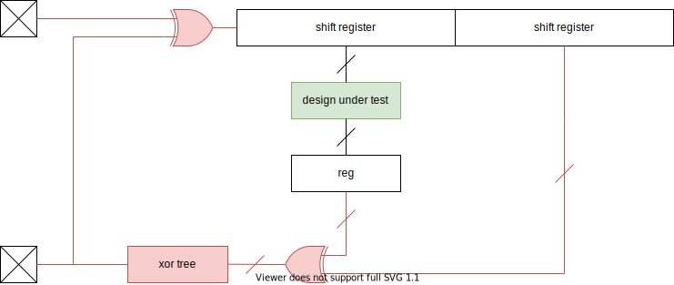

<!--
SPDX-FileCopyrightText: 2022 Google LLC

SPDX-License-Identifier: Apache-2.0
-->

# bittide-instances
Collection of monomorphic instances of realistic Bittide components. These instances are meant
to be handled bittide-shake.

This collection contains instances with various purposes:
* CI tests that ensure all components will meet timing.
* Instances that can be loaded onto the KCU105 target board.
* Hardware in the loop tests.

## General approach
We synthesize each component in the package `Bittide` and their composites on their own. Each should meet the target frequency of 200 MHz. (Note that when two components meet timing, their composite might not.) Not every component is suitable for top-level integration - due to the sheer number of pins required for some. To get timing information still, we can either synthesize using [Out of Context commands](https://docs.xilinx.com/r/2021.2-English/ug905-vivado-hierarchical-design/Synthesis?tocId=vkakVL_suw7wlNgcaeVIYQ) (TODO: Implement) or go through the whole flow using `Bittide.Instances.Hacks.reducePins`. This wrapper makes sure that a design with any number of pins is mapped to a single input and a single output pin - while making sure synthesis can't eliminate any logic due to this. This way, we can run Vivado all the way up to implementation:

The build system automatically generates _false path_ constraints for all input and output pins. Hence, any paths from the input pin to the shift registers, and any paths from the output pin to the output of a flipflop are dismissed from timing analysis. This makes sure only the design under test is analyzed, not the logic inserted to map to a single input/output pin.

**Note that false path constraints are also generated for any reset lines. You therefore need to make sure to properly synchronize your resets before feeding them to a circuit.**

To learn more about using these instances, go to the [`README.md` in `bittide-shake`](../bittide-shake/README.md).
