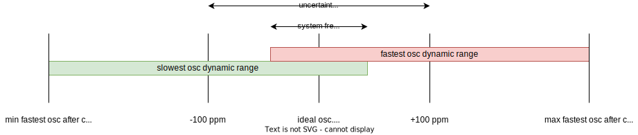
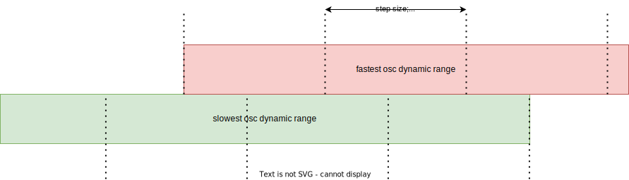

# elastic-buffer-sim
Simplified / idealized simulation of the behavior of Bittide systems with regards to their elastic buffers and clock control algorithms.

# Recap: Elastic buffer

* FIFO that hovers around ~50% data count
* Absorbs clock phase wobble (phase offsets + jitter + drift + corrections)
* Produces statistics for external logic for clock corrections

# Maximum clock frequency difference

* Oscillator uncertainty ±100 ppm
  * I.e., ±20 KHz for a clock of 200 MHz
  * I.e., ±0.04 elements in the FIFO per μs
     * or: ±1 element per 25 μs
* If we account for ±150 ppm maximum clock correction
  * ±50 KHz for a clock of 200 MHz
  * ±0.1 elements in the FIFO per μs
     * or: ±1 element per 10 μs
  * Clock multiplier setting (Si5395/Si5391)

# Clock multiplier configuration (1)

# Clock multiplier configuration (2)

# Open questions

* Choice parameters
  * FIFO depth
  * Step size FINC/FDEC
  * Dynamic range
  * Clock control algorithm
* Tiny divergence rates:
  * Lots of time to correct; given 200 MHz link freq; 1 MHz FINC/FDEC:
    * 200 data points per “correction cycle”
    * ~15 correction cycles min for element change
  * Seems to eliminate the need for complicated clock control algorithms
    * Can we “prove” this in simulation?
    * Can we prove this analytically?
  * Eliminate need for link-level “synchronization” phase?

# Goals

* Generate arbitrary node topologies
* Simulate arbitrary node topologies
* Easily swap clock control strategies and parameters
* Easily extract relevant (visualized) statistics
* For promising clock control algorithms: use Hedgehog to test against a great number of parameters, topologies, and dynamic behaviors.
* Integrate with the `bittide` project
  * In the end we should be able to do all the points above in a fully fledge Bittide system instead of a simplified/idealized one.
